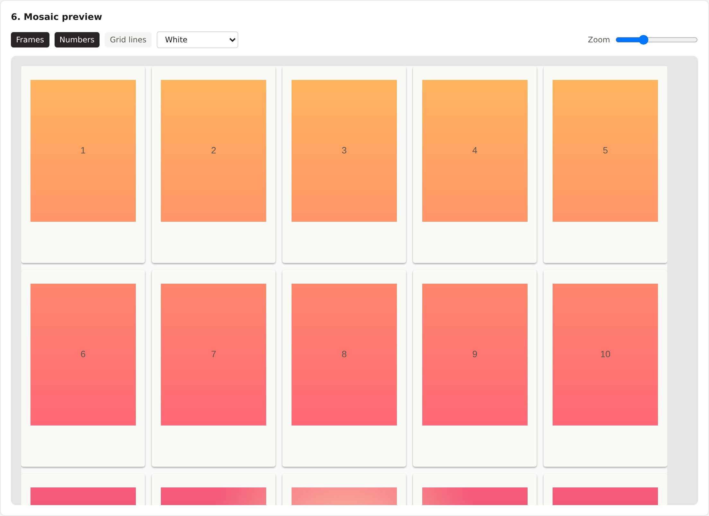

# Framosaic

Framosaic turns a photo into a grid of tiles sized for instant-film formats
(Polaroid, Instax, and others), so you can print each tile and reassemble
them into a big mosaic on your wall. Pick a format and grid, crop, preview
the finished mosaic with realistic frames, and export print-ready files
plus a gluing template that shows exactly where each print goes.

Everything runs entirely in your browser — your photo is never uploaded
anywhere.



## Features

- A **landing page** with a scrolling mosaic banner, then a full editor —
  click "Create mosaic" any time to jump in (the editor loads on demand,
  so the landing page itself stays fast)
- **Light/dark mode**, following your system by default, with a toggle
- **Format presets** for Instax Mini/Square/Wide and Polaroid 600/Go, plus a
  fully custom format
- **Aspect-locked crop tool** that recomputes live as you change the grid,
  gaps, or format
- **Two mapping modes**: spatially-correct (gaps show as real gaps between
  prints) or seamless (image content packed edge-to-edge)
- **Live mosaic preview** with realistic frames, a wall background, tile
  numbering, and a per-tile resolution inspector
- **Export**: a ZIP of correctly-named, correctly-sized tile images (PNG or
  JPEG, configurable DPI, image-area or full-frame with the white border
  baked in), plus a PDF gluing template (numbered overview + legend,
  optional 1:1 print-at-home template with crop marks, optional back-label
  reference sheet)
- **Home-print mode**: no instant-film printer? Print each tile at true
  physical size on regular paper and cut it out instead
- **Calibration page** to verify your printer isn't silently rescaling
- Undo/redo, save/load your project as `.json`, and non-destructive
  brightness/contrast/saturation/grayscale adjustments

## Development

Requires Node 22+.

```bash
npm install
npm run dev        # start the dev server
npm run build       # production build
npm run preview     # preview the production build locally
npm run lint         # oxlint
npm run typecheck    # tsc --noEmit
npm test              # vitest (unit tests)
npm run e2e:install   # one-time: install Playwright's browser
npm run e2e            # Playwright end-to-end + accessibility tests
```

Copy `.env.example` to `.env` to override the built-in config (GitHub link,
donation prompt) locally — see that file for details. None of these values
are secrets; everything in this app is public by design (it's compiled
straight into the browser bundle).

## Usage

1. **Upload a photo** — drag & drop, click to browse, or paste from the
   clipboard.
2. **Pick a format and grid** — choose an instant-film preset or enter a
   custom format, then set columns/rows manually or let Framosaic suggest a
   grid for a target physical width.
3. **Crop** — the crop tool is locked to the mosaic's aspect ratio and
   updates live as you change the format, grid, or gaps.
4. **Set gaps and adjustments** — spacing between prints, an outer margin,
   and non-destructive brightness/contrast/saturation/grayscale.
5. **Check the preview** — toggle frames, tile numbers, grid lines, and the
   wall background; click any tile to inspect its actual content and print
   resolution.
6. **Export** — download a ZIP of the tile images and a gluing-template PDF.
   If you don't have an instant-film printer, use the home-print panel
   instead to print each tile at true size on regular paper.
7. **Glue it to the wall** — use the gluing template's numbered overview
   (and, if you printed it, the 1:1 alignment pages) to place each print in
   the right spot.

### Calibrating your printer

Instant-film dimensions are industry-common approximations, and printers
can introduce their own small scaling error. Open **Calibration** in the
header, print that page at **100% / actual size** (not "fit to page"), and
measure the printed square and bar with a ruler. If they're off from 50mm,
adjust any Custom format dimensions you use by the resulting correction
factor.

### Supported formats

| Format | Film (mm) | Image area (mm) |
|---|---|---|
| Instax Mini | 54 × 86 | 46 × 62 |
| Instax Square | 72 × 86 | 62 × 62 |
| Instax Wide | 108 × 86 | 99 × 62 |
| Polaroid 600 / i-Type | 88 × 107 | 79 × 79 |
| Polaroid Go | 53.9 × 66.6 | 46 × 47 |
| Custom | any | any |

These are editable defaults, not exact manufacturer specs — verify them on
the Calibration page.

## Deployment

CI builds and deploys `main` to GitHub Pages automatically (see
`.github/workflows/ci.yml`). One-time setup on the GitHub side: in the
repo's **Settings → Pages**, set the source to "GitHub Actions"; in
**Settings → Branches**, add protection on `main` requiring the CI checks
to pass; in **Settings → Code security**, enable Secret Scanning and Push
Protection.

`netlify.toml` and `vercel.json` are included and ready to use if you'd
rather deploy there instead — both hosts support the full security-header
set (see [Security](#security) below), which GitHub Pages cannot.

## Security

This app is entirely client-side and needs no secrets — see
[SECURITY.md](SECURITY.md) for the reporting policy and repo hygiene
(secret scanning, branch protection, dependency updates). A
`Content-Security-Policy` is set via `<meta>` in `index.html` (the subset
that meta tags support); `netlify.toml`/`vercel.json` carry the full
header set, including `frame-ancestors`, for hosts that support custom
response headers.

## Trademark disclaimer

"Polaroid", "Instax", and "Fujifilm" are registered trademarks of their
respective owners. Framosaic is an independent, unofficial project — it is
not affiliated with, endorsed by, or sponsored by any of them. These names
are used solely to describe format compatibility.

## Support

If Framosaic is useful to you, consider
[supporting the project](https://buymeacoffee.com/joghurt). Entirely optional —
the app is free either way.

## Contributing

Issues and PRs are welcome — see the templates under `.github/`. Please
run `npm run lint`, `npm run typecheck`, and `npm test` before opening a
PR (CI runs the same checks, plus `npm run e2e` and a `gitleaks` secret
scan).

## License

MIT — see [LICENSE](LICENSE).
